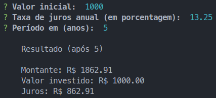

# Calculadora de juros compostos




> O projeto "calculadora de juros compostos" é uma _CLI_ (Command Line Interface) que tem a função de facilitar simulações de rendimento de aplicações sob juros compostos.


## 💻 Pré-requisitos

- Node e NPM/Yarn

- IDE de sua preferência

## 💻 Tecnologias

- TypeScript

- Inquirer.js

## 🚀 Execução do projeto

```bash
# Clone do repositório
$ git clone https://github.com/ImGabreuw/calculadora-de-juros-compostos.git

# Navegar ao diretório do projeto
$ cd ./calculadora-de-juros-compostos

# Rodar a aplicação
$ npm run start
```

## 📫 Contribuição

Para contribuir com **calculadora-de-juros-compostos**, siga estas etapas:

1. Bifurque este repositório.
2. Crie um branch: `git checkout -b <feature/funcionalidade>`.
3. Faça suas alterações e confirme-as: `git commit -m '<breve descrição sobre a funcionalidade>'`
4. Envie para o branch original: `git push origin <feature/funcionalidade>`
5. Crie a solicitação de pull.

Como alternativa, consulte a documentação do GitHub em [como criar uma solicitação pull](https://help.github.com/en/github/collaborating-with-issues-and-pull-requests/creating-a-pull-request).

## 🤝 Colaboradores

Agradecemos às seguintes pessoas que contribuíram para este projeto:

<table>
  <tr>
    <td align="center">
      <a href="https://github.com/ImGabreuw">
        <br>
        <sub>
          <b>ImGabreuw</b>
        </sub>
      </a>
    </td>
  </tr>
</table>

## 😄 Seja um dos contribuidores<br>

Quer fazer parte desse projeto? Clique [AQUI](CONTRIBUTING.md) e leia como contribuir.

## 📝 Licença

Esse projeto está sob licença. Veja o arquivo [LICENÇA](LICENSE.md) para mais detalhes.

[⬆ Voltar ao topo](#imersão-fullcycle-7.0)<br>
